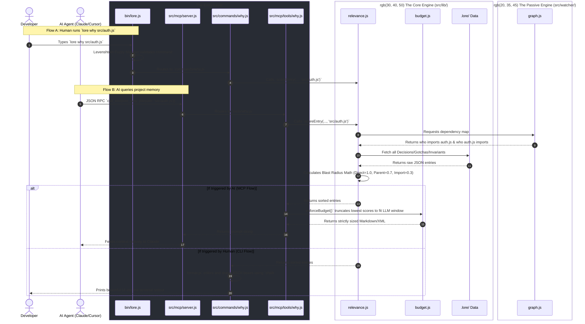

# The Lore Architecture Flow

The following sequence diagram outlines exactly how data moves through the Lore application, taking the command `lore why src/auth.js` as an example. 

It highlights both the CLI flow (for a human user) and the MCP flow (for an AI Agent).

